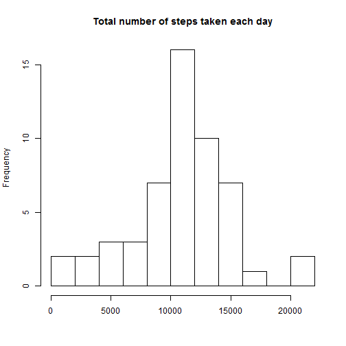
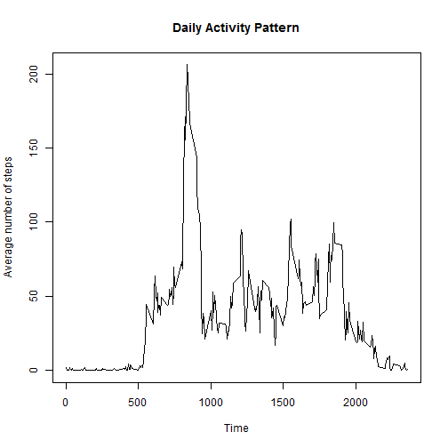
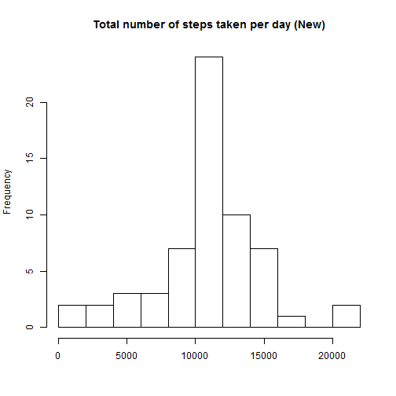
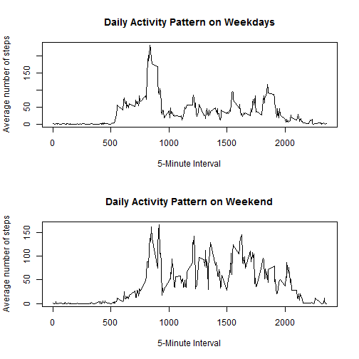

###Loading and preprocessing the data

First loading data.

```r
setwd("e:/data")
dat=read.csv("activity.csv",stringsAsFactors = FALSE)
dat$date=as.Date(dat$date)
str(dat)
```

```
## 'data.frame':	17568 obs. of  3 variables:
##  $ steps   : int  NA NA NA NA NA NA NA NA NA NA ...
##  $ date    : Date, format: "2012-10-01" "2012-10-01" ...
##  $ interval: int  0 5 10 15 20 25 30 35 40 45 ...
```


###What is mean total number of steps taken per day?

For this part we ignore the missing values in the dataset.

1.Calculate the total number of steps taken per day.

```r
sum(na.omit(dat$steps))
```

```
## [1] 570608
```

2.If you do not understand the difference between a histogram and a barplot, research the difference between them. Make a histogram of the total number of steps taken each day.

```r
datrm=dat[which(!is.na(dat$steps)),]
a=tapply(datrm[,1], datrm[,2], sum)
hist(a,15,main = "Total number of steps taken each day", xlab = "")
```

 

3.Calculate and report the mean and median of the total number of steps taken per day.

```r
mean(a)
```

```
## [1] 10766.19
```

```r
median(a)
```

```
## [1] 10765
```


###What is the average daily activity pattern?

1.Make a time series plot of the 5-minute interval (x-axis) and the average number of steps taken, averaged across all days (y-axis)

```r
b=tapply(datrm[,1], datrm[,3], mean)
plot(names(b),b,type="l",xlab = "Time", main = "Daily Activity Pattern", ylab = "Average number of steps")
```

 

2.Which 5-minute interval, on average across all the days in the dataset, contains the maximum number of steps?

```r
b[which.max(b)]
```

```
##      835 
## 206.1698
```


###Imputing missing values

1.Calculate and report the total number of missing values in the dataset.

```r
sum(is.na(dat$steps))
```

```
## [1] 2304
```

2.Devise a strategy for filling in all of the missing values in the dataset.
 
Using the mean of the 5-minute interval data to fill in the missing values in the dataset.

3.Create a new dataset that is equal to the original dataset but with the missing data filled in.

```r
ndat=dat
c=which(is.na(ndat$steps))
d=ndat[c,3]
d=as.character(d)
na.step=b[d]
ndat[which(is.na(ndat$steps)),1]=na.step
sum(is.na(ndat$steps))
```

```
## [1] 0
```

4.Make a histogram of the total number of steps taken each day and Calculate and report the mean and median total number of steps taken per day. Do these values differ from the estimates from the first part of the assignment? What is the impact of imputing missing data on the estimates of the total daily number of steps?

```r
a1=tapply(ndat[,1], ndat[,2], sum)
hist(a1,15, main = "Total number of steps taken per day (New)", xlab = "")
```

 

The mean and median total number of steps taken per day.

```r
mean(a1)
```

```
## [1] 10766.19
```

```r
median(a1)
```

```
## [1] 10766.19
```

```r
mean(a1)-mean(a)
```

```
## [1] 0
```

```r
median(a1)-median(a)
```

```
## [1] 1.188679
```

The impact of inputting missing data is minimal , it seems that only the median seems to be changing a little bigger than before .


###Are there differences in activity patterns between weekdays and weekends?

1.Create a new factor variable in the dataset with two levels �C “weekday” and “weekend” indicating whether a given date is a weekday or weekend day.

```r
wd=weekdays(ndat$date,abbreviate = T)
ndat1=data.frame(ndat,wd)
datweekday=subset(ndat1,ndat1$wd=="周一" | ndat1$wd=="周二" | ndat1$wd=="周三" | ndat1$wd=="周四" | ndat1$wd=="周五")
datweekend=subset(ndat1,ndat1$wd=="周六" | ndat1$wd=="周日" )
weekday=tapply(datweekday[,1], datweekday[,3], mean)
weekend=tapply(datweekend[,1], datweekend[,3], mean)
```

2.Make a panel plot containing a time series plot (i.e. type = "l") of the 5-minute interval (x-axis) and the average number of steps taken, averaged across all weekday days or weekend days (y-axis). See the README file in the GitHub repository to see an example of what this plot should look like using simulated data.

```r
par(mfrow=c(2,1))
plot(names(weekday) ,weekday,type="l",xlab = "5-Minute Interval", main = "Daily Activity Pattern on Weekdays", ylab = "Average number of steps")
plot(names(weekend),weekend,type="l",,xlab = "5-Minute Interval", main = "Daily Activity Pattern on Weekend", ylab = "Average number of steps")
```

 


`end` 
